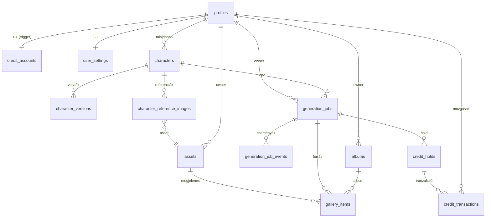

# Adatbázisdiagram (fő entitások)

- **Állapotgépek**: `generation_jobs` (draft→awaiting_credit→queued→submitted→processing→finalizing→completed
  /retrying/failed→refunded/cancelled; SQL-trigger: `job_transition_rules`), `characters`
  (`character_status_rules`). **Lock**: `finalize_claim` (lease 10 perc), atomi `claim_job`/`claim_next_job`.
- **Kreditek**: `credit_accounts.balance >= 0` (CHECK), `credit_holds` (open→charged/released/refunded),
  minden mozgás `idempotency_key`-jel (unique).
- **Provider-folyamat**: `provider`, `provider_job_id`, `provider_meta` (endpoint/status/response URL, weights).
